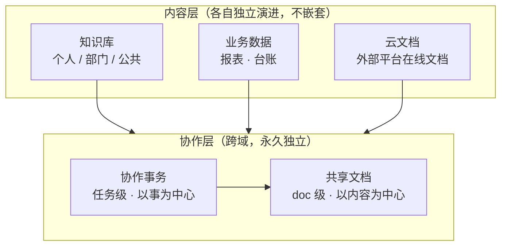

# 02 · 我的思考过程

## 第一步：先分清两件本质不同的事

我把混在一起的诉求拆成两类，判断标准是**变化频率和权限模型**：

| | 内容（静态资产） | 协作（动态过程） |
|---|---|---|
| 生命周期 | 长，以月/年计 | 短，以天/周计 |
| 权限逻辑 | 谁能看/能改这份内容 | 谁被卷进这件事 |
| 变更频率 | 低，结构稳定 | 高，状态频繁流转 |
| 典型对象 | 文档、数据表、文件目录 | 共享动作、任务、动态 |

**结论**：这两类东西不该长在同一层。内容层级要长期稳定演进，协作层级必须能快速改——硬塞一起的结果就是互相拖累。

## 第二步：三个架构方案怎么取舍

| 方案 | 做法 | 优点 | 致命问题 |
|---|---|---|---|
| A · 协作嵌进各内容域 | 每个内容域自带一套协作 | 局部体验顺 | 重复建设；跨内容域的协作无处安放 |
| B · 单一内容域 + 上层协作 | 先合并所有内容，再加协作层 | 协作统一 | 知识库/业务数据/云文档差异太大，硬合并会失真 |
| **C · 多内容域 + 独立协作层** | 内容域各自演进，协作层跨域贯通 | 各层独立演进；协作天然跨域 | 需要额外定义内容引用协议 |

**选 C**，理由只有两条，但都很硬：

1. 三类内容的形态、权限、更新方式差异过大，合并会削足适履；
2. 协作天生是跨域的——一个跨部门专项任务，会同时引用知识库文档、业务数据表和云文档。把协作挂在任何一个内容域下都是错的。

## 第三步：协作层内部还要再分粒度

协作不是只有一种。我又拆成两档，对应两种完全不同的心智：

| 模块 | 组织中心 | 用户念头 | 典型场景 |
|---|---|---|---|
| 共享文档 | 内容 | "让这几个人看这份东西" | 发一版方案给同事征求意见 |
| 协作事务 | 事 | "把这件事推完" | 跨部门专项，含多个待办、多个附件 |

**为什么需要两个**：只看内容维度，跨文档的一件事会被拆散；只看事务维度，"随手分享一份文件"又太重。两者共存，用"专项任务"承接复杂协作。

## 第四步：粒度只做两档，不做无限层级

内容挂载支持**单文件**和**多文件/目录**两档。为什么不做无限层级：

- 无限层级的成本在检索和权限继承上呈指数上升
- 用户实际心智就两档："给我一份"和"给我这一堆"
- 层级越深，配置成本越高，越没人用

配套定了两条规则：**混附件追加**（一个协作对象里可混合挂载不同类型内容）、**跨平台搜索只做检索不复制内容**（保留外部平台原文链接与返回入口，避免内容同步和权限泄漏）。

## 第五步：明确不做什么

- **不做 IM 聊天**：协作靠任务状态和动态驱动，不靠即时消息；聊天会把"事"的上下文冲散
- **不做工作流引擎**：流程编排交给专业系统，产品只承接"任务级"的轻量协作
- **不做在线协同编辑**：文档编辑能力依赖外部平台，产品负责连接而非重造
